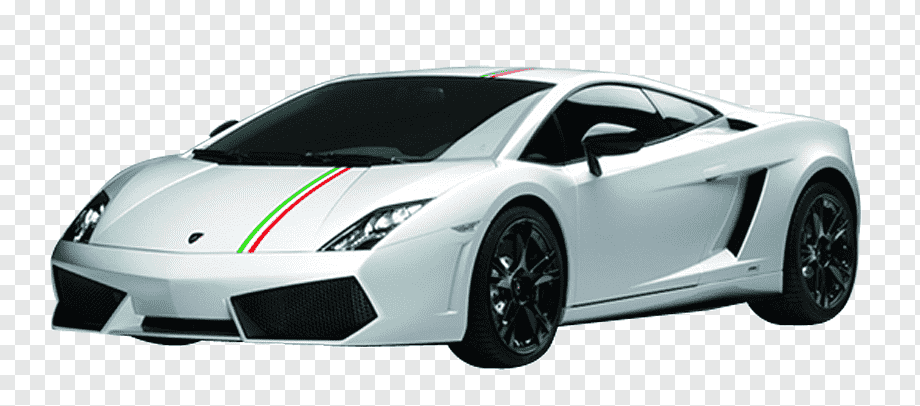

# 🚗💥 КРУТИЕ МАШЫНЫ - Рофельная Гонка



## 🎮 Описание

**Крутие Машыны** - это максимально рофельная и угарная игра-гонка, созданная в шутку! Управляй крутой машиной, избегай препятствий и не врезайся в другие машины, иначе будет **БУМ!** 💥

## 🚀 Особенности

- 🎨 **Рофельный дизайн** - безумные цвета, анимации и эффекты
- 📱 **Мобильная оптимизация** - играй на телефоне и компьютере
- 🎵 **Звуки и музыка** - фоновая музыка и звук взрыва
- 💥 **Крутые взрывы** - анимированные взрывы при столкновении
- 🎮 **Простое управление** - клавиатура, мышь, тач-управление
- 🏆 **Система очков** - набирай очки и улучшай результат

## 🎯 Как играть

1. **Запусти игру** - открой `index.html` в браузере
2. **Выбери режим**:
   - "СССР БОЛЬШЕ НЕТ" - посмотри рофельное видео
   - "ИГРАТЬ" - начать гонку
3. **Управление**:
   - **Клавиатура**: стрелки ← → или WASD
   - **Мышь**: клик по левой/правой части экрана
   - **Мобильные**: касание экрана или кнопки внизу
4. **Цель**: избегай машин на дороге и не врезайся!
5. **При столкновении**: БУМ! 💥 и игра окончена

## 🚗 Машины в игре

- **Lamborghini** - твоя машина (игрок)
- **Mashina** - обычная машина на дороге
- **Mercedes** - повернута на 45° вправо
- **Bugatti** - повернута на 45° влево

## 📱 Мобильная версия

Игра полностью адаптирована для мобильных устройств:
- Сенсорное управление
- Адаптивный дизайн
- Большие кнопки управления
- Оптимизация для разных размеров экрана

## 🛠 Технологии

- **HTML5** - структура игры
- **CSS3** - рофельные стили и анимации
- **JavaScript** - игровая логика
- **Canvas API** - игровой движок
- **Web Audio API** - звуки и музыка

## 🎨 Файлы проекта

```
krytiemashini/
├── index.html          # Главная страница
├── css/
│   └── style.css       # Рофельные стили
├── script.js           # Игровая логика
├── img/                # Изображения и медиа
│   ├── dodge.png       # Машина в меню (слева)
│   ├── lamba2.png      # Машина в меню (справа)
│   ├── lamborghini.png # Игрок
│   ├── mashina.png     # Машина на дороге
│   ├── mercedes.png    # Машина на дороге
│   ├── bugatti.png     # Машина на дороге
│   ├── doroga.webp     # Фон дороги
│   ├── explosion.png   # Взрыв
│   └── SSSR.MP4        # Рофельное видео
├── ogonek.mp3          # Фоновая музыка
├── boom.mp3            # Звук взрыва
├── .gitignore          # Git ignore
└── README.md           # Этот файл
```

## 🚀 Запуск

1. Скачай или клонируй репозиторий
2. Открой `index.html` в любом современном браузере
3. Наслаждайся рофелем! 🎉

### 🎵 Медиафайлы

**Включено в репозиторий:**
- ✅ **boom.mp3** - звук взрыва (placeholder)
- ✅ **ogonek.mp3** - фоновая музыка (placeholder)  
- ✅ **img/SSSR.MP4** - рофельное видео (placeholder)

**Для полной функциональности:**
- Замени placeholder файлы на реальные медиафайлы
- Игра работает с placeholder файлами, но без звуков и видео
- Полная функциональность с реальными медиафайлами! 🎉

## 🎯 Игровые экраны

- **Главное меню** - выбор режима игры
- **Видео экран** - просмотр рофельного видео
- **Игровой процесс** - сама гонка
- **Экран окончания** - результат и кнопки

## 💀 Рофельные фишки

- Безумные цвета и градиенты
- Анимированный заголовок
- Пульсирующие кнопки
- Тряска при проигрыше
- Рофельные надписи
- Comic Sans шрифт везде!

## 🏆 Система очков

- Очки начисляются за время выживания
- Скорость увеличивается со временем
- Чем дольше играешь - тем больше очков!

## 🎵 Звуки

- **ogonek.mp3** - фоновая музыка
- **boom.mp3** - звук взрыва при столкновении

## 🐛 Известные баги

- Это не баги, это фичи! 😄

## 📝 Лицензия

Этот проект создан в шутку для развлечения. Используй на свой страх и риск! 😂

## 👨‍💻 Автор

Создано с любовью и большим количеством рофеля! 🚗💥

---

**ВНИМАНИЕ**: Эта игра создана исключительно в шутку! Не воспринимай всерьез! 😄🎮
